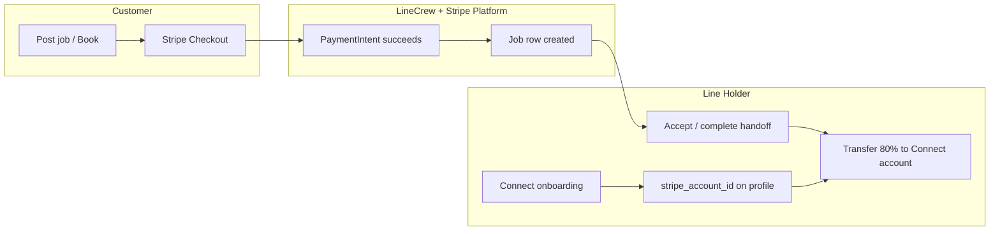
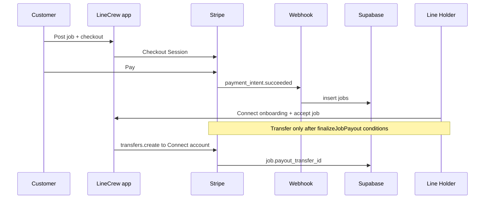

# LineCrew — Payment & payout process (current implementation)

_Generated from codebase review. For operations, see also `docs/STRIPE_DASHBOARD_SETUP.md`, `docs/PAYOUT_OPTIONS.md`, `docs/GO_LIVE_CHECKLIST.md`._

## Actors

| Actor | Role in payments |
|--------|------------------|
| **Customer** | Pays via Stripe Checkout (platform account). |
| **Line Holder (waiter)** | Receives **Connect transfers** to a Stripe Express connected account; optional **manual** payout methods in Profile. |
| **Platform** | Stripe Connect **platform** account; holds checkout charges; creates **transfers** to connected accounts after job completion. |

---

## High-level flow (overview)

---

## 1. Customer checkout (pay for a booking)

1. Customer signs in (`role: customer`), fills **Post job** (`app/dashboard/customer/post-job/`).
2. **Server action** `postJobAction` builds metadata (price, airport, legal ack versions, etc.) and creates a **Stripe Checkout Session** (`stripe.checkout.sessions.create`) — see `app/dashboard/customer/post-job/actions.ts`.
3. Customer completes payment on Stripe-hosted Checkout.
4. **Webhook** `app/api/stripe/webhook/route.ts`:
   - `payment_intent.succeeded` **or** `checkout.session.completed` → `handlePaymentIntentSucceeded`.
5. On success, a row is inserted into **`jobs`** with `status: "open"`, `stripe_payment_intent_id`, `offered_price`, etc. Idempotency: duplicate PI id is skipped.

**Key files:** `post-job/actions.ts`, `lib/stripe-job-metadata.ts`, `app/api/stripe/webhook/route.ts`, `app/api/confirm-checkout/route.ts` (client confirmation path).

---

## 2. Line Holder — Stripe Connect (payouts onboarding)

1. Waiter signs in; **Payouts** card on `app/dashboard/waiter/` or Profile (`WaiterPayoutSetup`).
2. **Server action** `startStripeConnectOnboardingAction` (`app/dashboard/waiter/connect/actions.ts`):
   - Ensures Express `stripe_account_id` (create or recover by metadata/email).
   - Creates **Account Link** with type:
     - **`account_onboarding`** until Stripe reports both `details_submitted` and `payouts_enabled` on the connected account (mirrored in `profiles`).
     - **`account_update`** only after both flags are **true** in the app DB (for bank/profile updates).
3. User completes Stripe **Review and confirm** (must click **Confirm**); otherwise onboarding stays incomplete.
4. **Sync** from Stripe into `profiles`:
   - Webhook `account.updated` → updates `stripe_details_submitted`, `stripe_payouts_enabled`.
   - Manual **Refresh Stripe status** → `refreshStripeConnectStatusAction` → `syncStripeConnectFromStripeForUser` (`lib/stripe-account-sync.ts`).

**Manual payout:** Profile can set Zelle/Cash App/etc.; gating for accepting jobs may treat manual payout as sufficient — see `WaiterPayoutSetup` props and profile form.

---

## 3. Job lifecycle and payout to Line Holder

1. Open job → waiter accepts → work / handoff flows (status transitions in app).
2. When the booking reaches the correct terminal state, **`finalizeJobPayout`** (`lib/stripe-release-payout.ts`):
   - Computes **80%** of `offered_price` (20% platform fee constant in code).
   - `stripe.transfers.create` to `destination: profile.stripe_account_id`.
   - Idempotent via `payout_transfer_id` on `jobs`.

**Key files:** `lib/stripe-release-payout.ts`, callers in dashboard/job actions (e.g. customer job actions reference transfers).

---

## 4. Data stored (Stripe-related)

| Location | Fields |
|----------|--------|
| `profiles` | `stripe_account_id`, `stripe_details_submitted`, `stripe_payouts_enabled`, manual payout fields |
| `jobs` | `stripe_payment_intent_id`, `payout_transfer_id`, `offered_price`, `waiter_id`, `status` |

---

## 5. Known integration constraints (as implemented)

- **Connect Account Link types:** Stripe rejects `account_update` for accounts that have **not** finished onboarding. The app must use `account_onboarding` until both `details_submitted` and `payouts_enabled` are true in Stripe (and synced to DB).
- **Refresh:** Client calls server action to pull Stripe account state; UI may look unchanged if Stripe still reports incomplete onboarding until the user confirms on Stripe.

---

## Appendix — sequence: checkout → job → transfer

---

_End of document._
